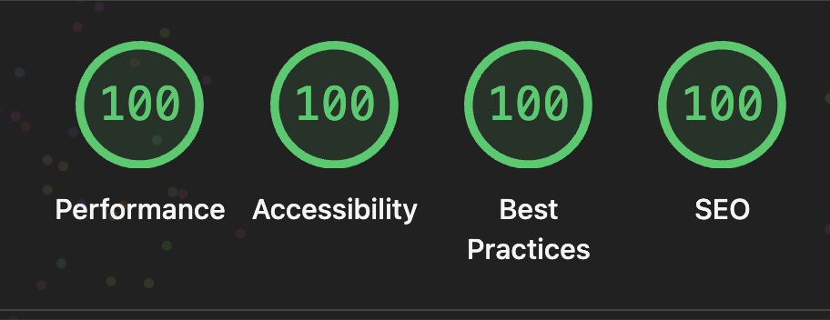

# 단로그 (danlog)

기록하는 개발자의 개인 블로그. 개발과 관련된 코드·생각을 정리해 공유합니다.

🔗 https://danlog.vercel.app

## Lighthouse



## 기술 스택

- **Astro** — 정적 사이트 생성, 콘텐츠 컬렉션 기반 블로그
- **React** — 커스텀 컴포넌트
- **Tailwind CSS v4** — 디자인 토큰 기반 스타일링 (라이트/다크 테마)
- **MDX** + rehype-pretty-code — 마크다운 글 작성, 코드 하이라이팅
- **bun** — 패키지 매니저 / 런타임
- **oxlint · oxfmt** — 린트 / 포매팅

## 명령어

| 명령어            | 설명                         |
| :---------------- | :--------------------------- |
| `bun install`     | 의존성 설치                  |
| `bun run dev`     | 개발 서버 (`localhost:4321`) |
| `bun run build`   | 프로덕션 빌드 (`./dist/`)    |
| `bun run preview` | 빌드 결과 로컬 미리보기      |
| `bun run lint`    | oxlint 검사                  |
| `bun run fmt:fix` | oxfmt 포매팅 적용            |

## 구조

```text
src/
├── components/        # Astro 컴포넌트 + react/ (검색, 테마 토글 등)
├── content/blog/      # 블로그 글 (Markdown / MDX)
├── layouts/           # 공통 레이아웃
├── lib/               # 유틸 (markdown 헬퍼 등)
├── pages/             # 라우트 (블로그, 프로필, robots.txt, sitemap 등)
├── shared/constants/  # 랜딩·프로필 콘텐츠 상수
└── styles/            # 전역 CSS / 디자인 토큰
```

## 글 작성

`src/content/blog/<글-제목>/index.md`(또는 `.mdx`)로 추가합니다. frontmatter:

```yaml
---
title: '제목'
description: '한 줄 설명'
date: 2026-01-01
tags: ['React', 'TypeScript']
---
```
